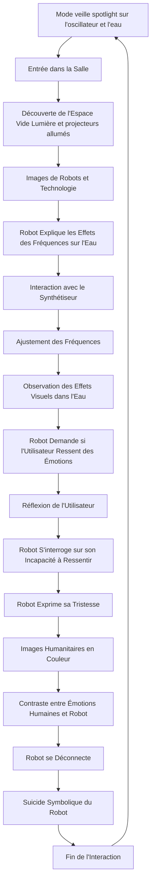
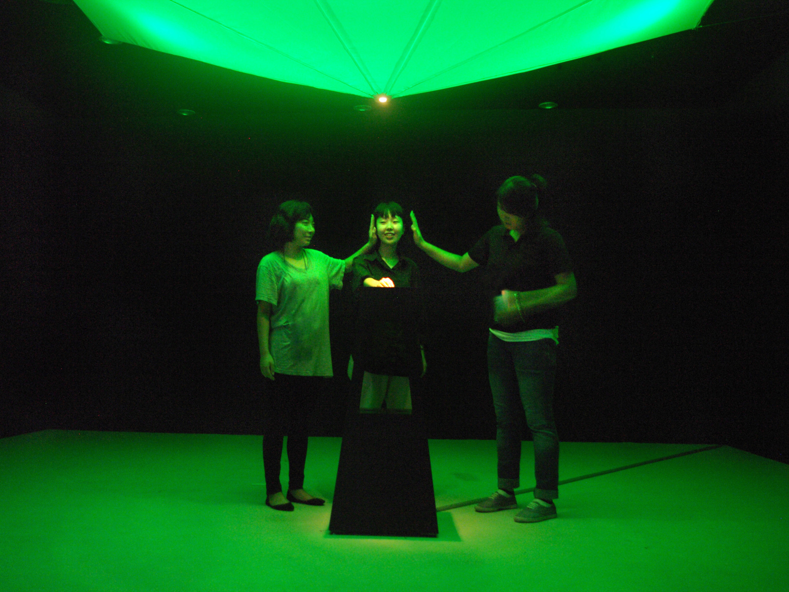
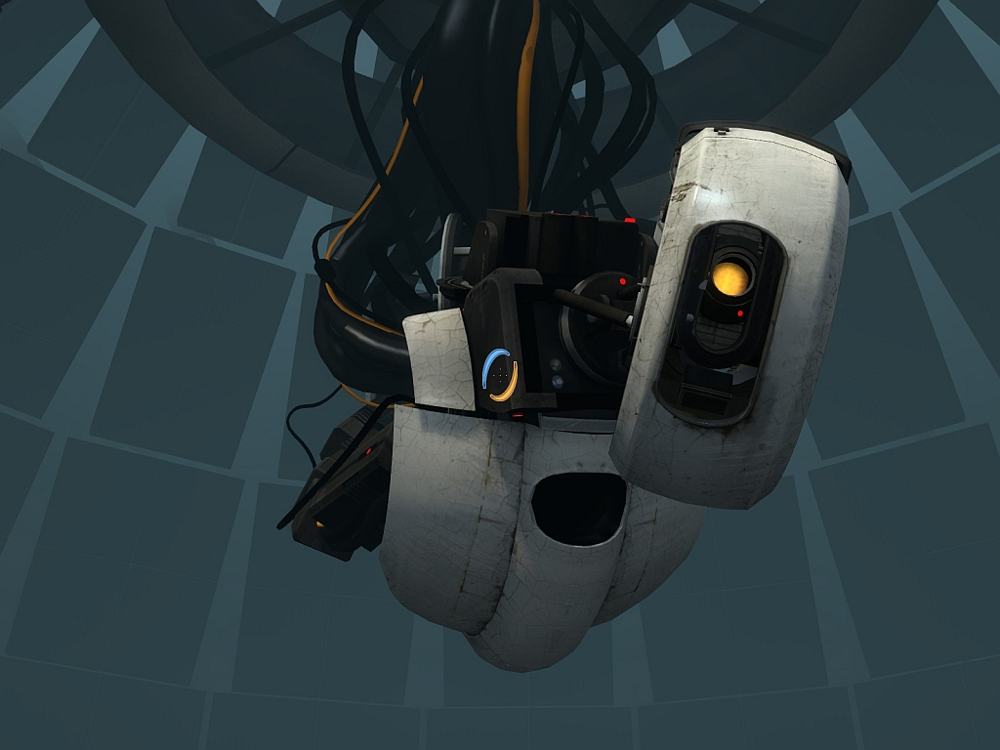
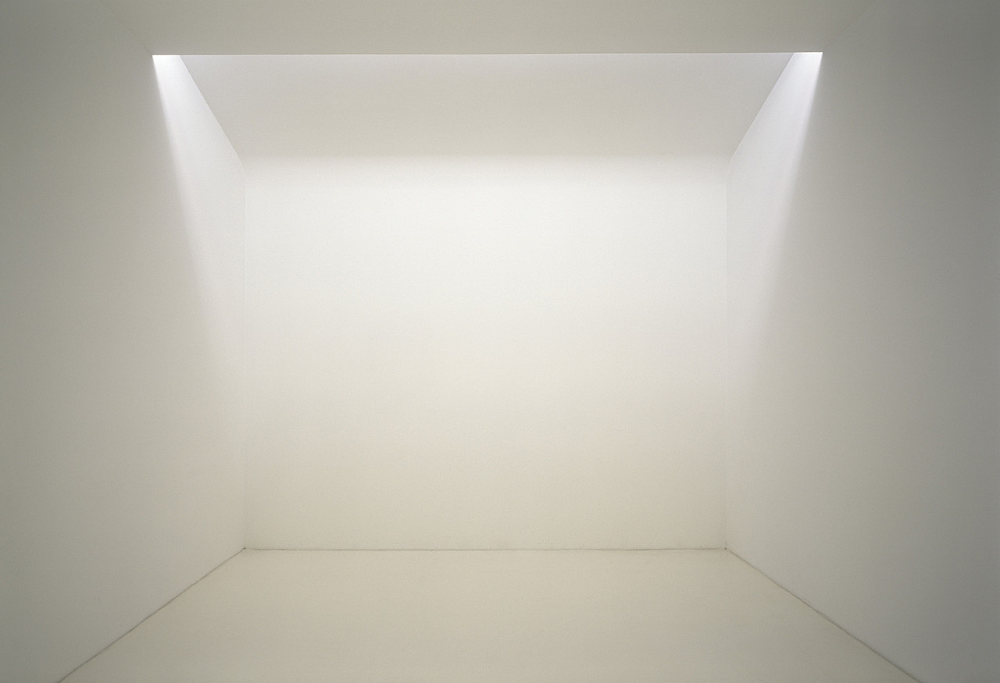
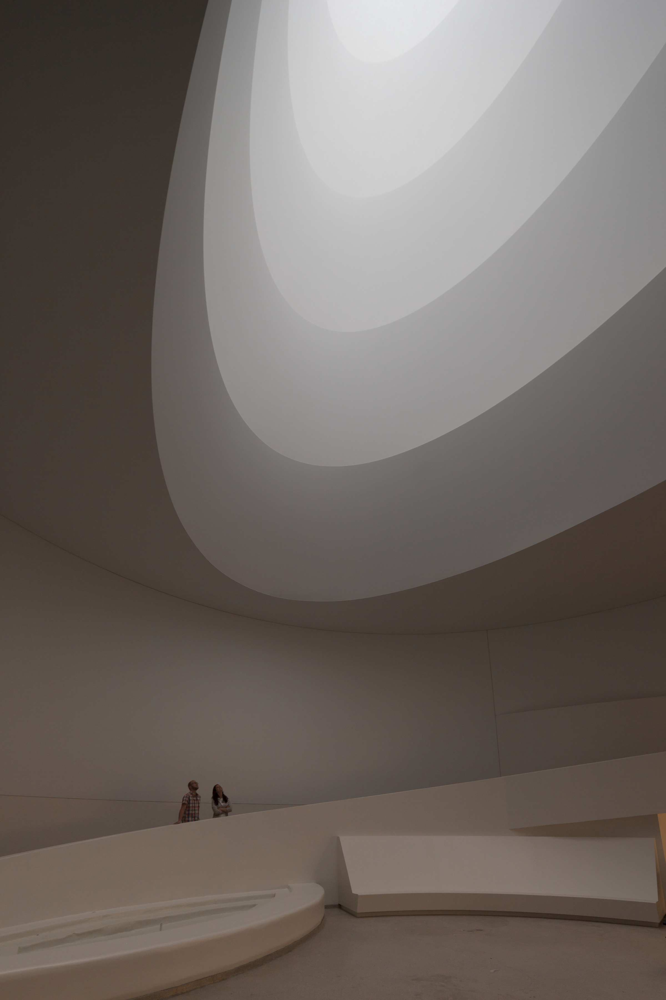
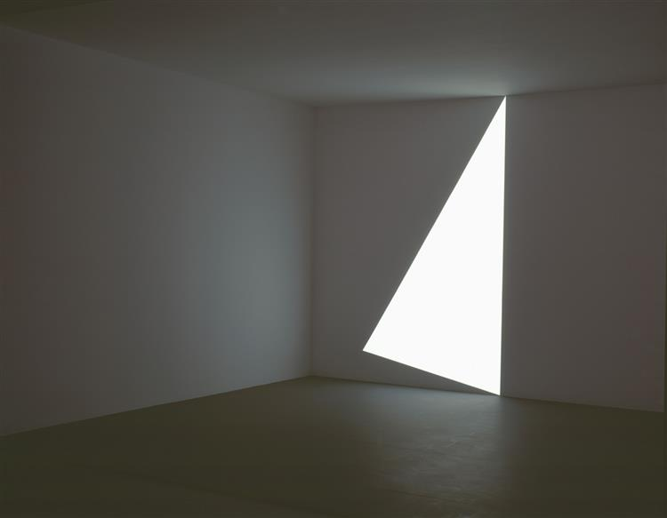
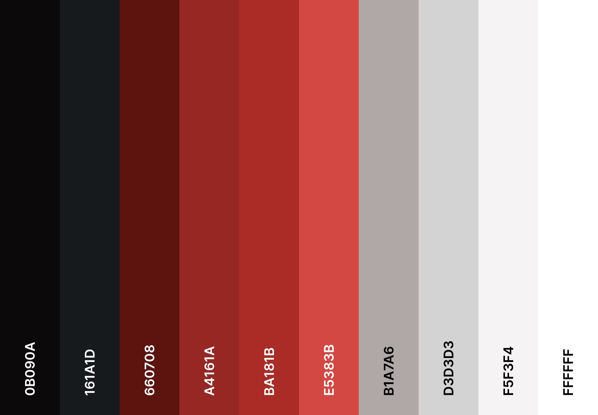

# La Résonance du Vide

## Idée
“La résonance du vide” est une installation artistique immersive qui explore les effets visuels et sonores de la lévitation acoustique, tout en invitant les participants à une introspection personnelle. Les visiteurs interagissent avec une table de contrôle pour modifier la fréquence des ondes sonores, observant les effets sur l'eau et l'environnement sonore. Un robot, conçu comme une intelligence artificielle, accompagne cette expérience en expliquant les effets sonores sur l'eau et partageant des réflexions sur les émotions humaines liées aux fréquences.

## Concept
L'installation utilise la lévitation acoustique pour démontrer comment les fréquences modifient les motifs dans l'eau et influencent un environnement sonore et visuel. Le robot, avec sa voix apaisante, guide les visiteurs à travers les différentes interactions, créant un contraste entre la logique algorithmique et la subjectivité humaine.

## Objectifs
- **Expérientiels :** Offrir une expérience immersive permettant aux visiteurs d'explorer les phénomènes scientifiques visuels et sonores tout en stimulant une réflexion personnelle.
- **Émotionnels :** Susciter une prise de conscience sur la manière dont les fréquences acoustiques influencent non seulement les objets mais aussi les émotions et la perception individuelle.
- **Éducatifs :** Illustrer les principes de la lévitation acoustique et des ondes sonores, en mettant en lumière leur impact à la fois scientifique et personnel.

## Motivations
L'intégration de l'art et de la science à travers l'acoustique et la visualisation offre une manière innovante d'explorer des concepts abstraits. Le projet cherche à engager les visiteurs dans une expérience qui dépasse la simple observation scientifique pour inclure une dimension introspective.

- **Espace Interactif :

- ** L'installation se déroule dans une pièce vide, blanche, dépouillée de couleur, dotée uniquement d'un synthétiseur et d'un bol d'eau. Cette neutralité renforce l'idée que l'humain est le seul à pouvoir dégager et propager des émotions dans cet espace.
- **Projections :** Des images de robots et d'intelligences artificielles créant des robots sont projetées sur les murs. Lorsque le robot questionne les émotions humaines, les images prennent vie en couleur, contrastant avec la blancheur du reste de la pièce.
- **Intervention du Robot :** À chaque changement de fréquence, le robot exprime sa tristesse de ne pas pouvoir ressentir les émotions humaines.
- **Réactions Visuelles :** Les écrans affichent des représentations graphiques des fréquences en temps réel.
- **Réflexion :** Une zone dédiée permet aux visiteurs de consigner leurs réflexions personnelles.

### Narratif
- **Introduction :** Accueil des visiteurs dans une ambiance immersive.
- **Exploration :** Interaction avec la table de contrôle, accompagnée par le robot.
- **Réflexion :** Espace de contemplation pour réfléchir à l'expérience personnelle.

## Expérience Utilisateur
- **Possibilités d'Exploration :**
  - Ajuster les fréquences pour voir les changements dans l'eau.
  - Observer les effets sonores et leur impact émotionnel.
  - Explorer l'espace de réflexion.

## Ambiance
### Moodboard
- **Visuels :** Motifs fluides dans l'eau, ondes sonores, vidéo de sujet robotique/humanitaire et espace vide.

- **Son :** Échantillons de sons d’eau, mélodies ambiantes, voix de robot.

### Palette de Couleurs

## Références Artistiques
- **Oeuvres :**
  - [Acoustic Levitation](https://www.ancient-origins.net/news-science-space-mysterious-phenomena/acoustic-levitation-floating-wave-sound-00684)
  - [Chladni Patterns](https://youtu.be/eskZ3OORfYM)
  - [Chladni Patterns on water](https://youtu.be/It83KlZ61l0)
  - [James Turrell](https://youtu.be/udlzm3Ea3RE)
- **Films :**
  - [Koyaanisqatsi](https://www.youtube.com/watch?v=BRItSHelLr4)
- **Jeu :**
- - [Portal;](https://youtu.be/KkNYZ430qGw)

## Technologies
### Support Média
- **Audio :** Panneau de contrôle (synthétiseur) contrôlant les fréquences, 1 haut-parleur à haute fidélité et 4 haut-parleurs pour projeter la voix robotique dans les coins de la pièce.
- **Vidéo :** Projections interactives sur les murs.
- **Lumières :** LEDs programmables.

### Matériel
- **Technologies interactives :** Contrôleurs tactiles ou synthétiseur, 5 haut-parleurs et 3 projecteurs Raspberry Pi pour contrôler tout le système, câbles HDMI et XLR, lumière de type LED.
- **Plateformes et outils :** Eau sur plateforme et planche de bois pour insérer les contrôleurs et placer le haut-parleur contenant l'eau, ainsi que pour les 4 murs.

### Logiciels
- **Projection :** TouchDesigner.
- **Audio :** Ableton Live relié à Max.
- **3D du robot :** Blender.
- **Voix du robot :** Ableton live.
- **Réseautage et Communication :** OSC ou MIDI.

